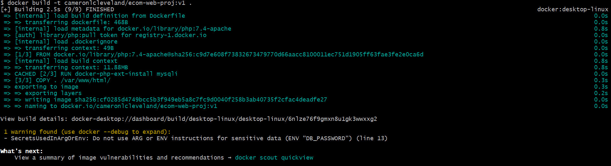
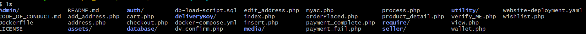

# **Kubernetes Resume Challenge: Step-by-Step Guide for Beginners**

Welcome to this comprehensive walkthrough of the **Kubernetes Resume Challenge**! This guide is designed for beginners who want to gain hands-on experience with **Docker, Kubernetes, and DevOps best practices** while building a real-world e-commerce application deployment.  

By the end of this project, you will:  
✅ **Containerize** a web app and database  
✅ **Deploy** to a Kubernetes cluster (AWS/Azure/GCP)  
✅ **Scale, update, and roll back** deployments  
✅ **Use ConfigMaps, Secrets, and Helm**  
✅ **Implement CI/CD and Persistent Storage**  

---

## **Prerequisites**  
Before we begin, ensure you have:  
- A **Docker Hub** account ([Sign Up Here](https://hub.docker.com/))  
- A **cloud account** (AWS, GCP, or Azure) with Kubernetes cluster access  
- **kubectl** installed ([Installation Guide](https://kubernetes.io/docs/tasks/tools/))  
- **Helm** installed (Optional, for advanced steps) ([Installation Guide](https://helm.sh/docs/intro/install/)  
- Basic knowledge of **Linux, Docker, and YAML**  

---

# **Step 1: Containerize the E-Commerce Web App**  

### **A. Create a Dockerfile**  
  
Navigate to your project directory and create a `Dockerfile`:  

```dockerfile
# Use PHP with Apache
FROM php:7.4-apache

# Install mysqli extension for database connectivity
RUN docker-php-ext-install mysqli

# Copy application files to Apache web directory
COPY . /var/www/html/

# Update database connection to use Kubernetes service (replace placeholders)
ENV DB_HOST=mysql-service
ENV DB_USER=admin
ENV DB_PASSWORD=password
ENV DB_NAME=ecom_db

# Expose port 80 for web traffic
EXPOSE 80
B. Build and Push the Docker Image
(screenshots/01-docker/docker-build-process.png)

Build the image:

sh
docker build -t yourdockerhubusername/ecom-web:v1 .
Push to Docker Hub:

sh
docker push yourdockerhubusername/ecom-web:v1
(screenshots/01-docker/docker-push-success.png)
(screenshots/01-docker/docker-images-list.png)
Outcome: Your web app is now containerized and available on Docker Hub.

Step 2: Prepare the Database (MariaDB)
Instead of building a custom DB image, we'll use the official MariaDB image in Kubernetes.

A. Create a Database Initialization Script (db-load-script.sql)
(screenshots/02-database/database-sql-script.png)

sql
CREATE DATABASE IF NOT EXISTS ecom_db;
USE ecom_db;

CREATE TABLE products (
    id INT AUTO_INCREMENT PRIMARY KEY,
    name VARCHAR(255),
    price DECIMAL(10,2)
);

INSERT INTO products (name, price) VALUES ('Laptop', 999.99), ('Phone', 699.99);
Outcome: This script will initialize the database when the MariaDB pod starts.

Step 3: Set Up Kubernetes on a Cloud Provider
Choose a cloud provider and create a managed Kubernetes cluster:

Provider	Service	Guide
AWS	EKS	EKS Setup
GCP	GKE	GKE Setup
Azure	AKS	AKS Setup
After cluster creation, configure kubectl:

sh
aws eks --region us-east-1 update-kubeconfig --name my-cluster  # AWS
gcloud container clusters get-credentials my-cluster --region us-central1  # GCP
az aks get-credentials --resource-group my-resource-group --name my-cluster  # Azure
Verify cluster access:
(screenshots/03-kubernetes-setup/kubectl-get-nodes.png)

sh
kubectl get nodes
(screenshots/03-kubernetes-setup/eks-cluster-creating.png)
(screenshots/03-kubernetes-setup/eks-cluster-active.png)
Outcome: You now have a working Kubernetes cluster!

Step 3.5: Create Database Secret
(screenshots/07-troubleshooting/create-db-secret.png)

bash
kubectl create secret generic db-secret \
  --from-literal=password=mysecurepassword \
  --from-literal=db_name=ecom_db

# Verify it was created
kubectl get secret db-secret -o yaml
Step 4: Deploy the Website to Kubernetes
A. Create a website-deployment.yaml
(screenshots/04-deployment/website-deployment-yaml.png)

yaml
apiVersion: apps/v1
kind: Deployment
metadata:
  name: ecom-web
spec:
  replicas: 2
  selector:
    matchLabels:
      app: ecom-web
  template:
    metadata:
      labels:
        app: ecom-web
    spec:
      containers:
      - name: ecom-web
        image: yourdockerhubusername/ecom-web:v1
        ports:
        - containerPort: 80
        env:
        - name: DB_HOST
          value: "mysql-service"
        - name: DB_USER
          value: "admin"
        - name: DB_PASSWORD
          valueFrom:
            secretKeyRef:
              name: db-secret
              key: password
        - name: DB_NAME
          value: "ecom_db"
B. Deploy MariaDB with Persistent Storage
(screenshots/04-deployment/mysql-deployment-yaml.png)
Create mysql-deployment.yaml:

yaml
apiVersion: apps/v1
kind: Deployment
metadata:
  name: mysql
spec:
  replicas: 1
  selector:
    matchLabels:
      app: mysql
  template:
    metadata:
      labels:
        app: mysql
    spec:
      containers:
      - name: mysql
        image: mariadb:10.6
        env:
        - name: MYSQL_ROOT_PASSWORD
          valueFrom:
            secretKeyRef:
              name: db-secret
              key: password
        - name: MYSQL_DATABASE
          value: "ecom_db"
        - name: MYSQL_USER
          value: "admin"
        - name: MYSQL_PASSWORD
          valueFrom:
            secretKeyRef:
              name: db-secret
              key: password
        ports:
        - containerPort: 3306
        volumeMounts:
        - name: mysql-persistent-storage
          mountPath: /var/lib/mysql
      volumes:
      - name: mysql-persistent-storage
        persistentVolumeClaim:
          claimName: mysql-pvc
Create mysql-service.yaml:
(screenshots/04-deployment/mysql-service-yaml.png)

yaml
apiVersion: v1
kind: Service
metadata:
  name: mysql-service
spec:
  selector:
    app: mysql
  ports:
    - protocol: TCP
      port: 3306
      targetPort: 3306
Create a PersistentVolumeClaim (mysql-pvc.yaml) for database storage:
(screenshots/04-deployment/persistent-volume-claim.png)

yaml
apiVersion: v1
kind: PersistentVolumeClaim
metadata:
  name: mysql-pvc
spec:
  accessModes:
    - ReadWriteOnce
  resources:
    requests:
      storage: 5Gi
C. Apply All Configurations
(screenshots/07-troubleshooting/initial-deployment-apply.png)

sh
kubectl apply -f mysql-pvc.yaml
kubectl apply -f mysql-deployment.yaml
kubectl apply -f mysql-service.yaml
kubectl apply -f website-deployment.yaml
Verify pods are running:

sh
kubectl get pods
(screenshots/07-troubleshooting/pods-running-success.png)
Outcome: Your website and database are now running in Kubernetes!

Step 5: Expose the Website with a Load Balancer
Create website-service.yaml:
(screenshots/05-advanced/loadbalancer-service-yaml.png)

yaml
apiVersion: v1
kind: Service
metadata:
  name: ecom-web-service
spec:
  type: LoadBalancer
  selector:
    app: ecom-web
  ports:
    - protocol: TCP
      port: 80
      targetPort: 80
Apply it:
(screenshots/05-advanced/apply-loadbalancer.png)

sh
kubectl apply -f website-service.yaml
Get the external IP:
(screenshots/05-advanced/loadbalancer-external-ip.png)

sh
kubectl get svc ecom-web-service
Outcome: Your website is now accessible via the LoadBalancer IP!

Step 6: Implement Configuration Management (ConfigMaps)
A. Add "Dark Mode" Feature Toggle
Modify your web app to check for FEATURE_DARK_MODE environment variable.

Create a ConfigMap:

sh
kubectl create configmap feature-toggle-config --from-literal=FEATURE_DARK_MODE=true
Update website-deployment.yaml to include:
(screenshots/05-advanced/deployment-with-configmap.png)

yaml
env:
- name: FEATURE_DARK_MODE
  valueFrom:
    configMapKeyRef:
      name: feature-toggle-config
      key: FEATURE_DARK_MODE
Apply changes:

sh
kubectl apply -f website-deployment.yaml
Outcome: Your website now supports dark mode!

Step 7: Scale the Application
Scale up for increased traffic:

sh
kubectl scale deployment ecom-web --replicas=6
Verify scaling:
(screenshots/06-monitoring/pods-scaled-to-6.png)

sh
kubectl get pods
Outcome: Kubernetes automatically handles increased load!

Step 8: Perform a Rolling Update
Update your app code (e.g., add a promotional banner).

Build & push a new image:

sh
docker build -t yourdockerhubusername/ecom-web:v2 .
docker push yourdockerhubusername/ecom-web:v2
Update website-deployment.yaml to use v2.

Apply changes:
(screenshots/06-monitoring/rolling-update-success.png)

sh
kubectl apply -f website-deployment.yaml
Monitor rollout:

sh
kubectl rollout status deployment/ecom-web
Outcome: Zero-downtime update!

Step 9: Roll Back a Deployment
If the update fails:
(screenshots/06-monitoring/rollback-deployment-1.png)

sh
kubectl rollout undo deployment/ecom-web
Outcome: The app reverts to the previous stable version!

Step 10: Autoscale Based on CPU
Create a Horizontal Pod Autoscaler (HPA):
(screenshots/06-monitoring/hpa-command-2.png)

sh
kubectl autoscale deployment ecom-web --cpu-percent=50 --min=2 --max=10
Verify autoscaling:
(screenshots/06-monitoring/hpa-created.png)

sh
kubectl get hpa
Outcome: Kubernetes scales pods automatically under load!

Step 11: Implement Liveness & Readiness Probes
Update website-deployment.yaml:
(screenshots/05-advanced/deployment-with-probes-yaml.png)

yaml
livenessProbe:
  httpGet:
    path: /health.php
    port: 80
  initialDelaySeconds: 5
  periodSeconds: 10
readinessProbe:
  httpGet:
    path: /ready.php
    port: 80
  initialDelaySeconds: 5
  periodSeconds: 10
(screenshots/05-advanced/health-endpoint-php.png)
(screenshots/05-advanced/ready-endpoint-php.png)
Outcome: Kubernetes ensures only healthy pods serve traffic!

Troubleshooting Summary
During this project, I encountered and resolved several real-world issues across deployment stages. Below is a detailed breakdown of the challenges and their solutions, along with key takeaways.

1️⃣ Docker Image & Database Connection
Issue: The web app failed to connect to MySQL despite successful deployment.
(screenshots/07-troubleshooting/pods-failing-imagepullbackoff.png)
Root Cause:

Incorrect hostname in connection.php (localhost instead of the Kubernetes service name mysql-service)

Missing environment variables for database credentials

Fix:

Updated DB_HOST to mysql-service in the PHP connection script

Rebuilt the Docker image and redeployed:
(screenshots/07-troubleshooting/fixed-deployment-yaml-1.png)

bash
docker build -t username/ecom-web:v2 .
docker push username/ecom-web:v2
kubectl set image deployment/ecom-web ecom-web=username/ecom-web:v2
2️⃣ Storage Issues
Issue: Pods stuck in Pending state due to storage problems.
(screenshots/07-troubleshooting/storage-scheduling-error.png)
Fix: Updated PVC storage class and recreated resources.

3️⃣ Probes Configuration
Issue: Liveness/readiness probes failing initially.
Fix: Added proper health.php and ready.php endpoints.
(screenshots/05-advanced/pod-with-probes-running.png)

Next Steps:

Explore Ingress Controllers (Nginx, Traefik)

Learn Kubernetes Monitoring (Prometheus, Grafana)

Dive into Service Meshes (Istio, Linkerd)

Happy Learning! 😊

Project Structure
text
kubernetes-resume-challenge/
├── screenshots/          # 81 organized screenshots
│   ├── 01-docker/        # Docker build, push, analysis
│   ├── 02-database/      # SQL scripts, project structure
│   ├── 03-kubernetes-setup/ # EKS cluster setup
│   ├── 04-deployment/    # K8s manifests and deployment
│   ├── 05-advanced/      # LoadBalancer, ConfigMaps, Probes
│   ├── 06-monitoring/    # Scaling, HPA, rolling updates
│   └── 07-troubleshooting/ # Real-world issue resolution
├── manifests/            # Kubernetes YAML files
├── docker/               # Docker configuration
├── *.php                 # E-commerce application
└── README.md            # This documentation
🙏 Acknowledgements
Original project source: detronetdip/E-commerce
Kubernetes tutorials: Anton Putra Tutorials
